# 📚 Projeto Biblioteca — Banco de Dados SQL

Projeto de Banco de Dados desenvolvido para simular o gerenciamento de uma biblioteca utilizando **SQL e MariaDB**.

O sistema permite armazenar informações sobre **autores, categorias, livros, usuários e empréstimos**, utilizando conceitos como chaves primárias, chaves estrangeiras, relacionamentos, alterações de tabelas e consultas SQL.

---

## 🎯 Objetivo do Projeto

O objetivo deste projeto é aplicar na prática os principais conceitos estudados em Banco de Dados, incluindo:

- Criação de banco de dados;
- Criação e exclusão de tabelas;
- Chaves primárias (`PRIMARY KEY`);
- Chaves estrangeiras (`FOREIGN KEY`);
- Restrições `UNIQUE`;
- Inserção e atualização de dados;
- Alteração da estrutura de tabelas com `ALTER TABLE`;
- Consultas utilizando `WHERE`, `LIKE`, `BETWEEN` e `IN`;
- Relacionamento entre tabelas utilizando `INNER JOIN`;
- Tipos de dados como `VARCHAR`, `DATE`, `DATETIME`, `DECIMAL`, `YEAR` e `BOOLEAN`.

---

## 🛠️ Tecnologias Utilizadas

- SQL
- MariaDB
- Modelagem de Banco de Dados
- Git
- GitHub

---

# 🗂️ Modelagem do Banco de Dados

O banco de dados foi estruturado com cinco tabelas principais:

- `autor`
- `categoria`
- `livro`
- `usuario`
- `emprestimo`

### Relacionamentos

- Um **autor** pode possuir vários livros.
- Uma **categoria** pode possuir vários livros.
- Um **usuário** pode realizar vários empréstimos.
- Um **livro** pode aparecer em diferentes registros de empréstimo.

---

## 📊 Diagrama Entidade-Relacionamento (DER)

O diagrama abaixo representa a estrutura e os relacionamentos do banco de dados.

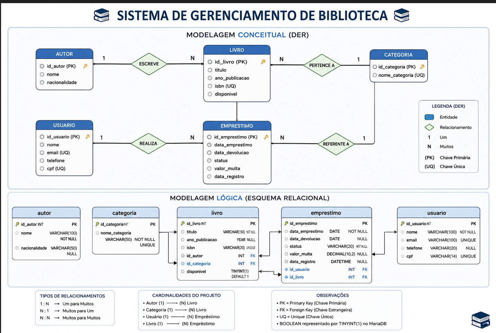

---

# 💻 Desenvolvimento do Banco de Dados

## 1. Estrutura inicial

Inicialmente foram criadas as tabelas `autor`, `categoria` e `usuario`.

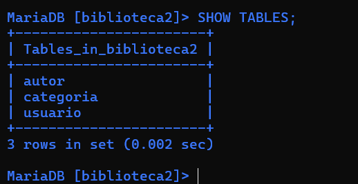

---

## 2. Primeira versão da tabela Livro

Foi criada inicialmente uma versão simplificada da tabela `livro`.

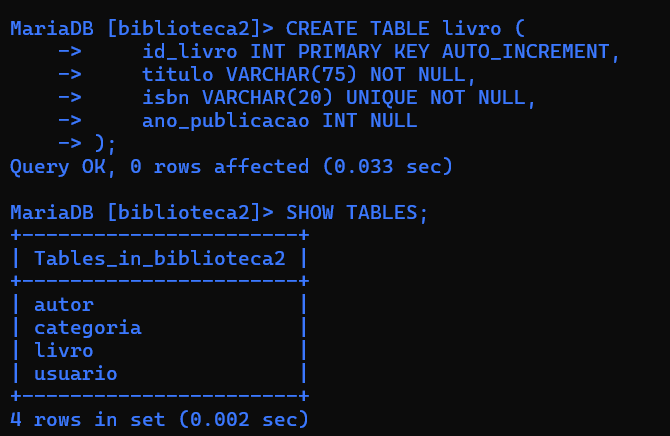

---

## 3. Exclusão da primeira tabela Livro

Durante o desenvolvimento, a primeira estrutura da tabela `livro` foi removida utilizando:

```sql
DROP TABLE livro;
```

Essa etapa fez parte do desenvolvimento do projeto, permitindo substituir a estrutura inicial por uma versão mais completa e com relacionamentos.

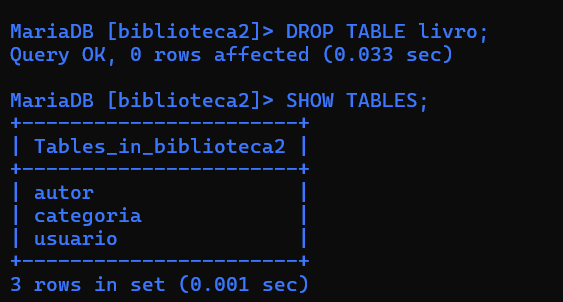

---

## 4. Criação definitiva da tabela Livro

A tabela `livro` foi recriada contendo relacionamentos com as tabelas `autor` e `categoria` através de chaves estrangeiras.

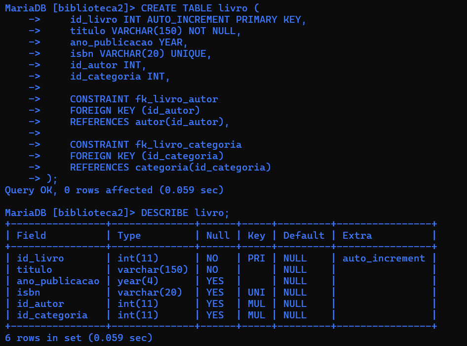

---

## 5. Criação da tabela Empréstimo

A tabela `emprestimo` foi criada para registrar os empréstimos realizados pelos usuários.

Ela possui relacionamentos com:

- `usuario`
- `livro`

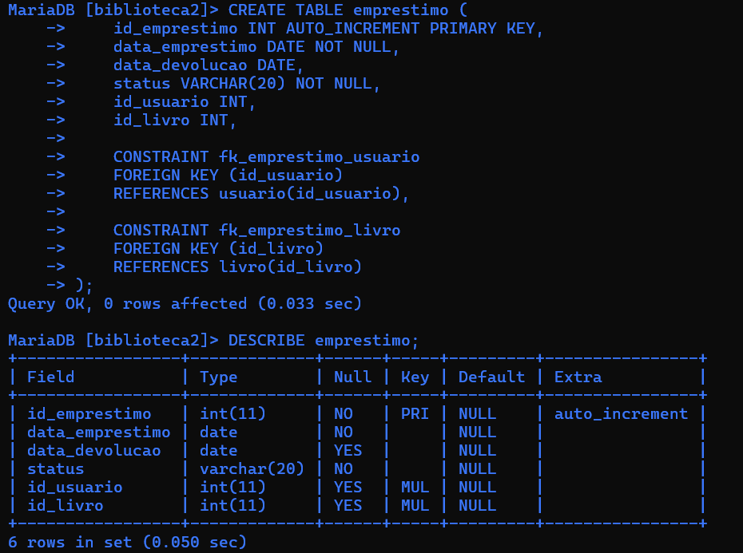

---

# 📝 Inserção de Dados

## 6. Cadastro de Autores

Foram cadastrados 10 autores no banco de dados.

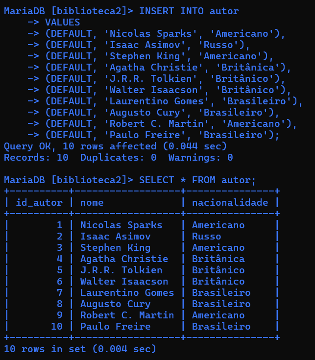

---

## 7. Cadastro de Livros

Foram cadastrados 10 livros, relacionados aos respectivos autores e categorias.

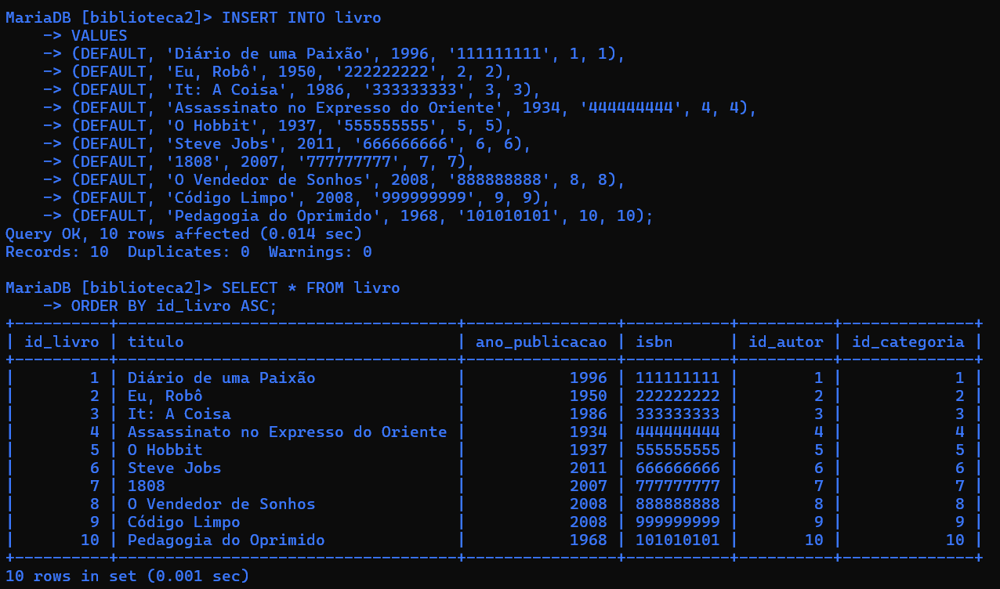

---

## 8. Adicionando CPF aos usuários

A estrutura da tabela `usuario` foi modificada utilizando `ALTER TABLE` para adicionar o campo `cpf` com restrição `UNIQUE`.

```sql
ALTER TABLE usuario
ADD cpf VARCHAR(14) UNIQUE;
```

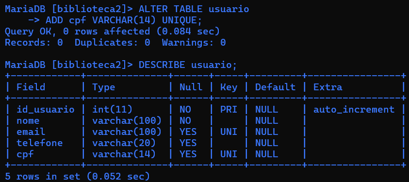

---

## 9. Cadastro de Usuários

Foram cadastrados 10 usuários contendo nome, e-mail, telefone e CPF.

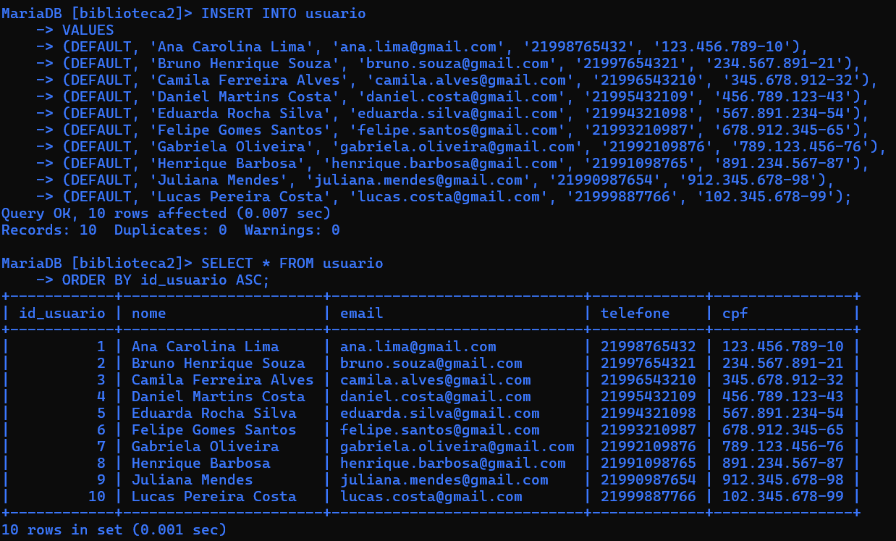

---

## 10. Registro de Empréstimos

Foram inseridos registros de empréstimos relacionando usuários e livros.

Os empréstimos possuem diferentes situações, como:

- Devolvido
- Atrasado
- Em andamento

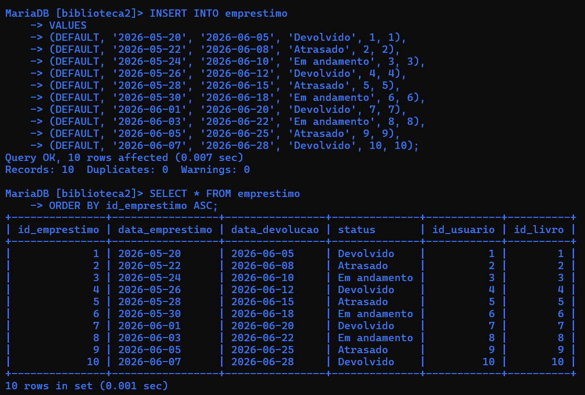

---

# 🔧 Alterações e Atualizações

## 11. DECIMAL, DATETIME e UPDATE

A tabela `emprestimo` recebeu dois novos campos:

```sql
valor_multa DECIMAL(10,2)
data_registro DATETIME
```

Também foram realizados comandos `UPDATE` para modificar registros específicos.

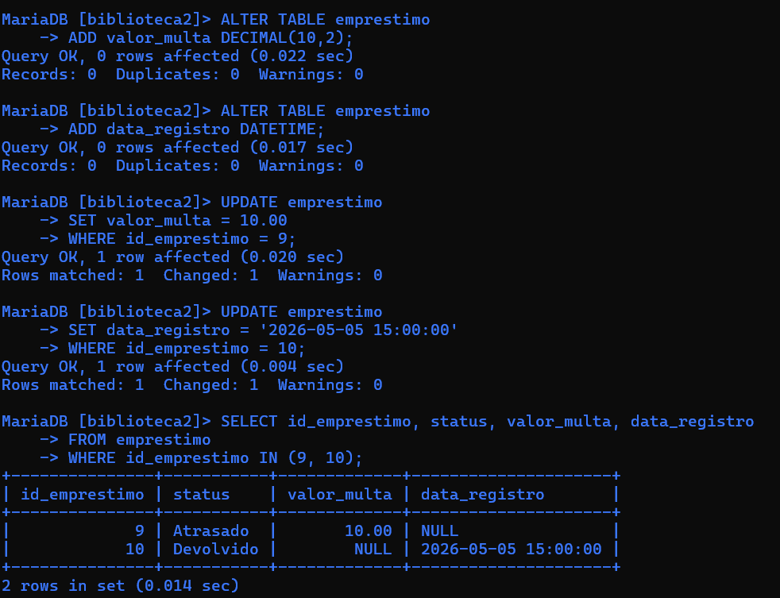

---

## 12. Disponibilidade dos Livros

Foi adicionada uma coluna do tipo `BOOLEAN` para representar a disponibilidade dos livros.

```sql
ALTER TABLE livro
ADD disponivel BOOLEAN;
```

Posteriormente os registros foram atualizados utilizando `CASE`.

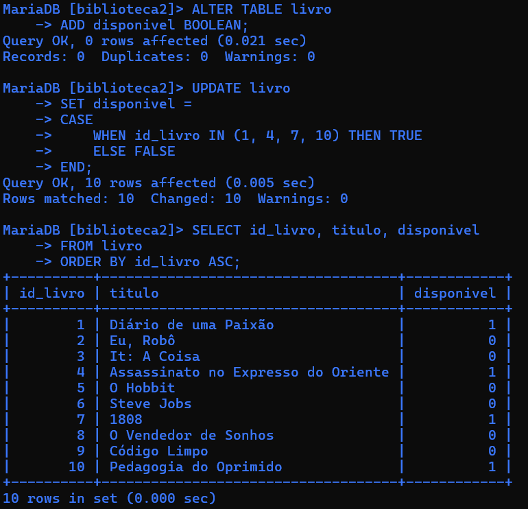

---

# 🔎 Consultas SQL

## 13. Consulta com WHERE

Utilização do `WHERE` para localizar um usuário específico.

```sql
SELECT *
FROM usuario
WHERE nome = 'Ana Carolina Lima';
```

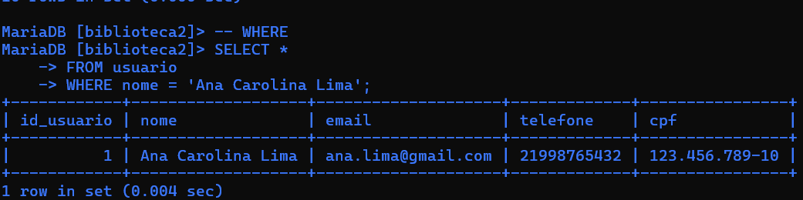

---

## 14. Consulta com LIKE

O operador `LIKE` foi utilizado para buscar usuários através de um padrão de texto.

```sql
SELECT *
FROM usuario
WHERE nome LIKE 'A%';
```

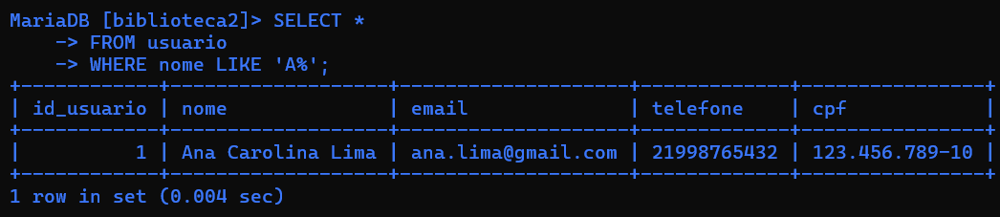

---

## 15. Consulta com BETWEEN

Utilização de `BETWEEN` para localizar livros publicados dentro de determinado período.

```sql
SELECT id_livro, titulo, ano_publicacao
FROM livro
WHERE ano_publicacao BETWEEN 1950 AND 2000
ORDER BY ano_publicacao ASC;
```

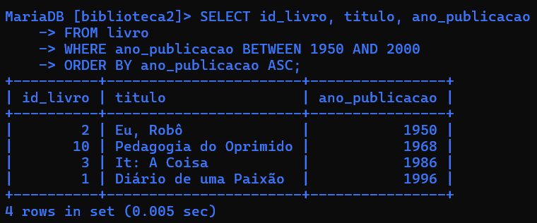

---

## 16. Consulta com IN

O operador `IN` foi utilizado para buscar vários usuários através de seus identificadores.

```sql
SELECT id_usuario, nome
FROM usuario
WHERE id_usuario IN (1, 3, 5, 7)
ORDER BY id_usuario ASC;
```

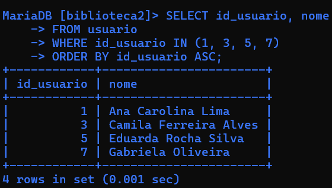

---

# 🔗 INNER JOIN

## 17. Usuários e Empréstimos

Relacionamento entre as tabelas `usuario` e `emprestimo`.

```sql
SELECT
    u.nome,
    e.data_emprestimo,
    e.status
FROM usuario u
INNER JOIN emprestimo e
    ON u.id_usuario = e.id_usuario
ORDER BY e.id_emprestimo ASC;
```

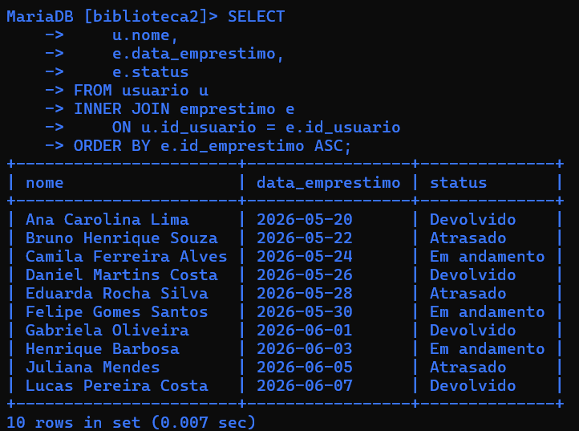

---

## 18. Livros e Empréstimos

Relacionamento entre os livros e seus respectivos registros de empréstimo.

```sql
SELECT
    l.titulo,
    e.data_emprestimo,
    e.data_devolucao
FROM livro l
INNER JOIN emprestimo e
    ON l.id_livro = e.id_livro
ORDER BY e.id_emprestimo ASC;
```

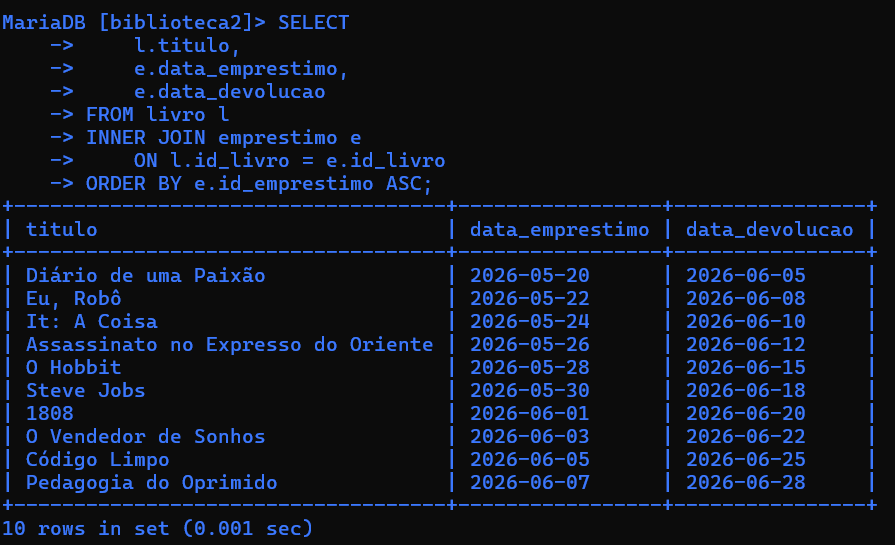

---

## 19. Livros e Autores

Relacionamento entre cada livro e seu respectivo autor.

```sql
SELECT
    l.titulo,
    a.nome AS autor
FROM livro l
INNER JOIN autor a
    ON l.id_autor = a.id_autor
ORDER BY l.id_livro ASC;
```

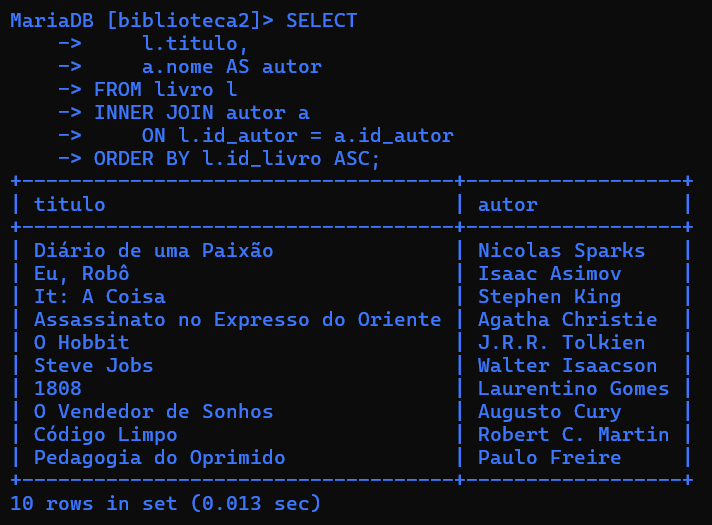

---

## 20. Livros e Categorias

Relacionamento entre cada livro e sua respectiva categoria.

```sql
SELECT
    l.titulo,
    c.nome_categoria
FROM livro l
INNER JOIN categoria c
    ON l.id_categoria = c.id_categoria
ORDER BY l.id_livro ASC;
```

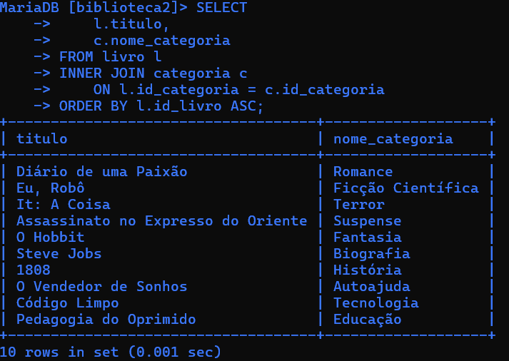

---

# 🏁 Estrutura Final

Ao final do desenvolvimento, o banco ficou composto pelas tabelas:

```text
autor
categoria
emprestimo
livro
usuario
```

A tabela `livro`, por exemplo, possui chave primária, chaves estrangeiras, ISBN único e controle de disponibilidade.

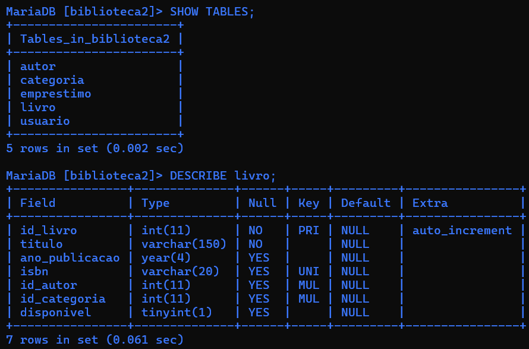

---

# 🧠 Conceitos Praticados

Durante o desenvolvimento deste projeto foram praticados conceitos importantes de Banco de Dados Relacional, como:

- Modelagem de banco de dados;
- Criação e exclusão de tabelas;
- Chaves primárias e estrangeiras;
- Integridade referencial;
- Relacionamentos entre tabelas;
- Inserção de registros;
- Alteração da estrutura de tabelas;
- Atualização de registros;
- Filtros e consultas SQL;
- `INNER JOIN`;
- Organização e documentação de um projeto de Banco de Dados.

---

## 📁 Arquivo SQL

O script completo utilizado para criação, inserção, alteração e consulta do banco de dados está disponível no arquivo:

**`biblioteca.sql`**

---

## 👨‍💻 Autor

**José Henrique Sarro dos Santos**

Projeto desenvolvido para fins de estudo e prática de **Banco de Dados e SQL**.
